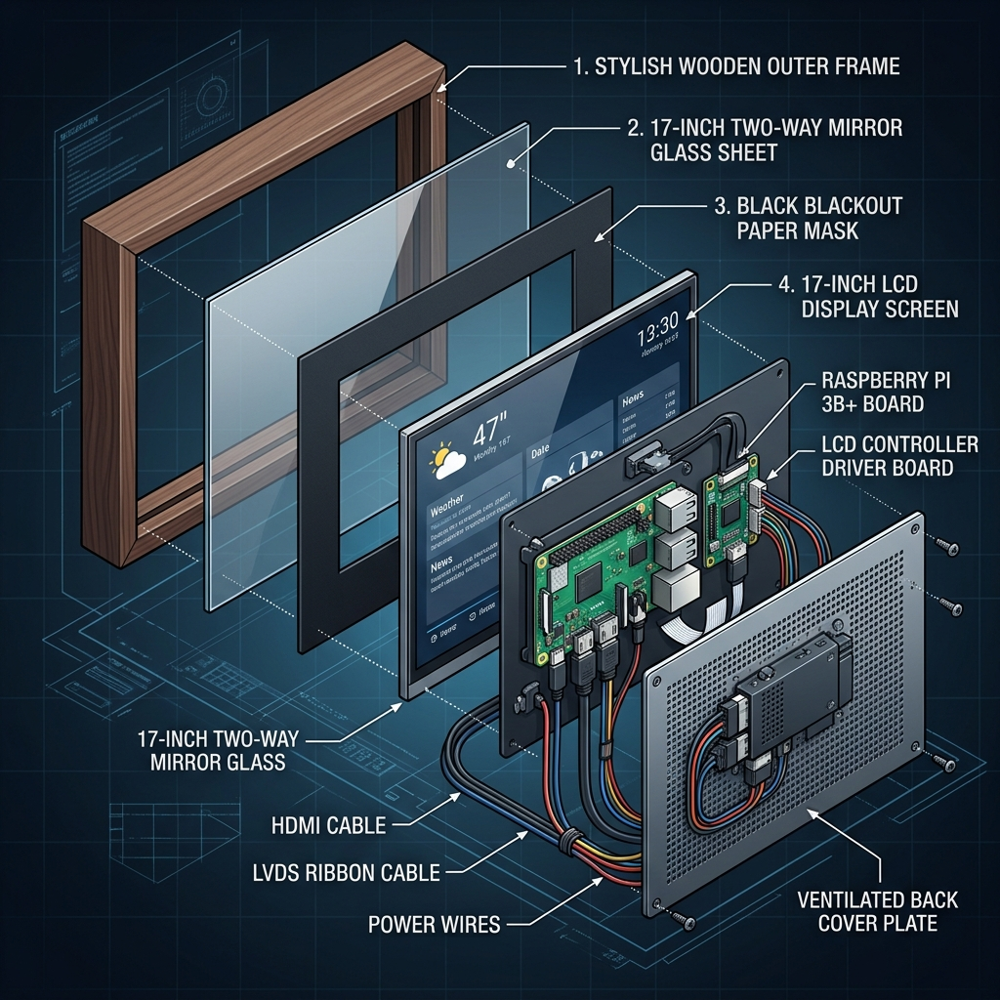
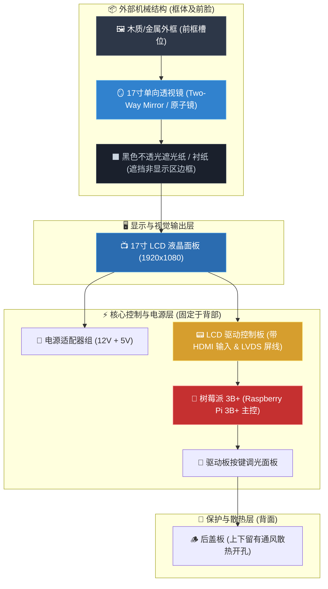
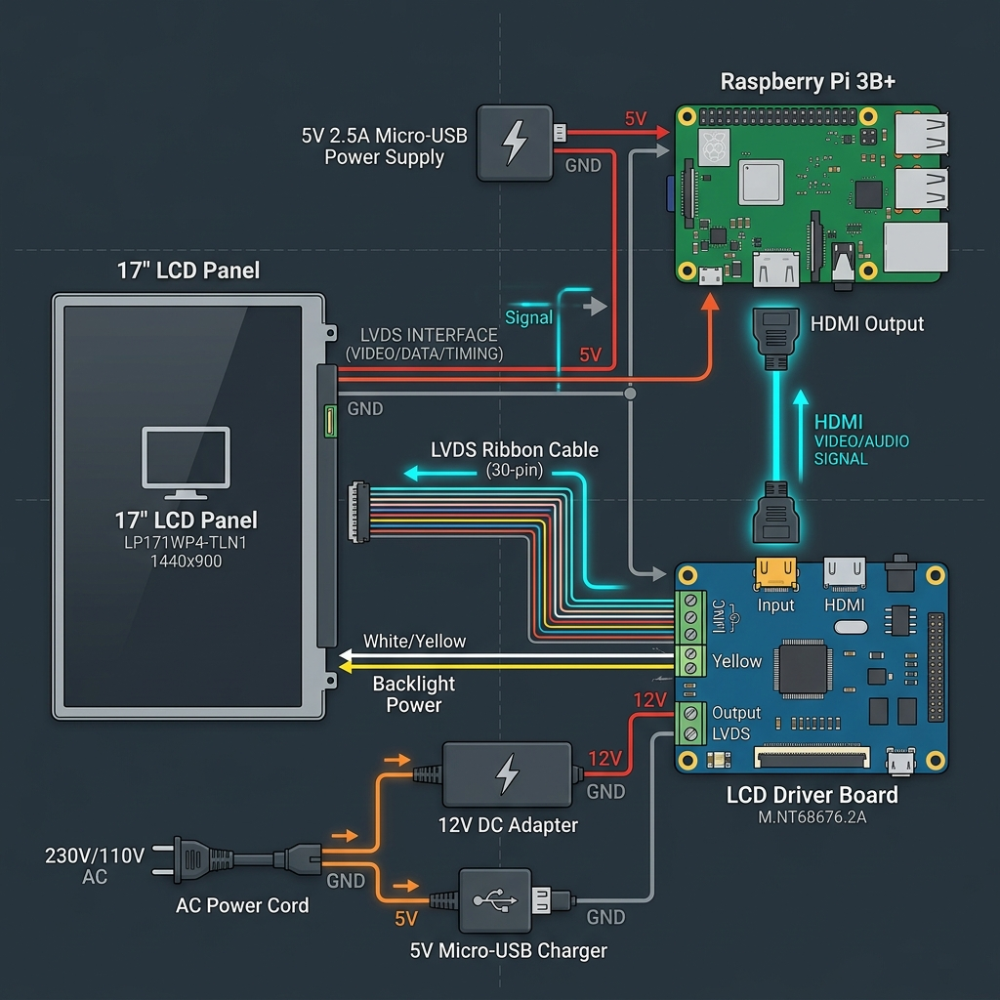

# 17寸树莓派 3B+ 智能魔镜 (MagicMirror²) 全套搭建指南

> [!abstract] 简介
> 本指南手把手教你如何使用 **树莓派 3B+** 和 **17 寸 1080P LCD 面板** 从零搭建一台可实时显示 **天气预报、待办任务提醒、Google Calendar 同步** 的智能魔镜 (MagicMirror²)。

---

## 🛠️ 1. 硬件清单与材料准备

> [!info] 硬件选型建议
> 树莓派 3B+ 性能完全能胜任 MagicMirror² 的运行，无需额外购买树莓派 4B/5。LCD 显示屏选购带 HDMI 接口的驱动板即可。

| 模块分类 | 硬件/材料名称 | 详细规格说明 |
| :--- | :--- | :--- |
| **主控核心** | 树莓派 3B+ (Raspberry Pi 3B+) | 1GB RAM，自带 Wi-Fi 与蓝牙 |
| | MicroSD 存储卡 | 16GB 或 32GB (Class 10 / A1 高速卡) |
| | 读卡器 | 用于在电脑上烧录系统 |
| | 电源适配器 | 5V / 2.5A~3A Micro-USB 接口供电 |
| **显示系统** | 17 寸 LCD 面板 (1920x1080) | 通用 16:9 液晶屏 |
| | LCD 驱动板套件 | 配套 LVDS 屏线、背光板与按键板，需带 **标准 HDMI** 输入 |
| | HDMI 线缆 | 标准 HDMI 线 (树莓派 3B+ 为标准 HDMI 口) |
| | 12V DC 电源 | 12V / 3A (给 LCD 驱动板供电) |
| **外观与光学** | 单向透视镜 (Two-Way Mirror) | 尺寸裁切至 17 寸，建议原子镜/双面镜（透光率 12%~20%，反射率 70%+） |
| | 外框 (木框 / 铝合金框) | 槽深约 5~8 cm，需容纳屏体、主板与电源线缆 |
| | 黑色遮光卡纸 | 贴于镜面背后，覆盖显示屏非发光区域，防止漏光 |

---

## 📐 2. 硬件架构图与电路拓扑

### 2.1 物理分层安装结构图 (Exploded View)

魔镜采用**多层堆叠结构**。最前层为透光反射镜面，中间为液晶屏与遮光衬纸，背部固定树莓派与驱动主板：





---

### 2.2 电气与信号线缆连接拓扑图 (Wiring Diagram)

连接树莓派 3B+、17 寸 LCD 屏驱动板、电源适配器与网络服务：



```mermaid
flowchart LR
    subgraph Power["🔌 供电系统 (220V 市电)"]
        AC["插头 220V AC"]
        Adapter12V["12V / 3A 电源适配器"]
        Adapter5V["5V / 3A Micro-USB 电源"]
        AC --> Adapter12V
        AC --> Adapter5V
    end

    subgraph RPi["🍓 树莓派 3B+ (Raspberry Pi 3B+)"]
        PiPower["Micro-USB 供电口"]
        PiHDMI["Standard HDMI 输出口"]
        PiSD["MicroSD 卡 (系统与MagicMirror)"]
        PiWifi["板载 Wi-Fi 模块"]
    end

    subgraph DisplaySystem["🖥️ 17寸显示系统"]
        DriverPower["DC 12V 供电接口"]
        DriverHDMI["HDMI 信号输入口"]
        DriverLVDS["LVDS 屏线接口"]
        DriverInverter["背光高压接口"]
        LCDPanel["17寸 LCD 液晶面板 (1080P)"]
        Keypad["按键调光控制面板"]
    end

    subgraph Cloud["☁️ 互联网与云端服务"]
        Router["🏠 家用 Wi-Fi 路由器"]
        GoogleCal["📅 Google Calendar (iCal)"]
        OWM["🌤 OpenWeatherMap API"]
        Todoist["📝 Todoist / Google Tasks"]
        Cloud --> Router
        Router --> GoogleCal & OWM & Todoist
    end

    %% 电气与线缆连接
    Adapter12V == "12V DC 电源线" ==> DriverPower
    Adapter5V == "5V Micro-USB 线" ==> PiPower
    PiHDMI == "标准 HDMI 线缆" ==> DriverHDMI
    
    DriverLVDS == "LVDS 30pin 屏线" ==> LCDPanel
    DriverInverter == "背光线" ==> LCDPanel
    Keypad == "控制排线" ==> DriverHDMI

    Router -. "Wi-Fi 无线连接" .- PiWifi

    classDef rpi fill:#9b2c2c,stroke:#feb2b2,color:#fff;
    classDef display fill:#2c5282,stroke:#90cdf4,color:#fff;
    classDef pwr fill:#d69e2e,stroke:#faf08f,color:#1a202c;
    classDef cloud fill:#276749,stroke:#9ae6b4,color:#fff;

    class RPi,PiPower,PiHDMI,PiSD,PiWifi rpi;
    class DisplaySystem,DriverPower,DriverHDMI,DriverLVDS,DriverInverter,LCDPanel,Keypad display;
    class Power,AC,Adapter12V,Adapter5V pwr;
    class Cloud,Router,GoogleCal,OWM,Todoist cloud;
```

---

## 💾 3. 第一阶段：树莓派系统烧录

1. 在电脑上打开 [Raspberry Pi Imager](https://www.raspberrypi.org/software/)。
2. 插入 MicroSD 卡。
3. 选择 **Raspberry Pi OS (64-bit/32-bit Desktop 版)**。
4. 在预设置（OS Customization）中提前勾选：
   - 开启 SSH（密码验证）
   - 配置 Wi-Fi 名称与密码
   - 设置用户名 `pi` 与登录密码
5. 点击 **Write** 烧录完成后插入树莓派通电开机。

---

## 🚀 4. 第二阶段：安装 MagicMirror² 核心环境

通过 SSH 登录树莓派（或在桌面终端执行）：

```bash
# 1. 更新系统软件包
sudo apt update && sudo apt upgrade -y

# 2. 安装 Node.js (推荐 v20 LTS) 与 Git
curl -fsSL https://deb.nodesource.com/setup_20.x | sudo -E bash -
sudo apt install -y nodejs git

# 3. 克隆 MagicMirror 仓库
cd ~
git clone https://github.com/MagicMirrorOrg/MagicMirror.git

# 4. 安装依赖
cd MagicMirror
npm run install-mm

# 5. 复制样本配置文件
cp config/config.js.sample config/config.js
```

---

## ⚙️ 5. 第三阶段：功能模块代码配置

编辑配置文件 `~/MagicMirror/config/config.js`：

```bash
nano ~/MagicMirror/config/config.js
```

> [!tip] 语言与单位配置
> 将顶部基础参数修改为简体中文和公制单位：
> ```javascript
> language: "zh-cn",
> locale: "zh-CN",
> timeFormat: 24,
> units: "metric",
> ```

---

### 5.1 📅 Google Calendar 日历同步配置

> [!important] 如何获取谷歌日历秘密 iCal 链接
> 1. 打开 [Google Calendar 网页版](https://calendar.google.com/)。
> 2. 点击右侧“设置和共享” -> “集成日历”。
> 3. 复制 **“iCal 格式的非公开网址 (Secret address in iCal format)”**。

在 `config.js` 中配置 `calendar` 模块：

```javascript
{
    module: "calendar",
    header: "我的行程计划",
    position: "top_left",
    config: {
        maximumEntries: 8,
        maximumNumberOfDays: 14,
        displaySymbol: true,
        defaultSymbol: "calendar-check",
        calendars: [
            {
                symbol: "google",
                url: "https://calendar.google.com/calendar/ical/YOUR_SECRET_ADDRESS/basic.ics" // 替换为你的秘密链接
            }
        ]
    }
},
```

---

### 5.2 🌤 OpenWeatherMap 天气预报配置

> [!key] API 注册
> 1. 注册 [OpenWeatherMap 免费账号](https://openweathermap.org/) 复制 **API Key**。
> 2. 查询所在城市的经纬度（如北京：`lat: 39.9042, lon: 116.4074`）。

```javascript
// 实时天气
{
    module: "weather",
    position: "top_right",
    config: {
        weatherProvider: "openweathermap",
        type: "current",
        lat: 39.9042,
        lon: 116.4074,
        apiKey: "YOUR_OPENWEATHERMAP_API_KEY",
        showHumidity: true
    }
},
// 未来 5 天天气预报
{
    module: "weather",
    position: "top_right",
    header: "天气预报",
    config: {
        weatherProvider: "openweathermap",
        type: "forecast",
        lat: 39.9042,
        lon: 116.4074,
        apiKey: "YOUR_OPENWEATHERMAP_API_KEY",
        maxNumberOfDays: 5
    }
},
```

---

### 5.3 📝 Todoist 任务提醒模块配置

在终端安装第三方模块 `MMM-Todoist`：

```bash
cd ~/MagicMirror/modules
git clone https://github.com/cujo/MMM-Todoist.git
cd MMM-Todoist && npm install
```

在 [Todoist 开发者后台](https://todoist.com/) 获取 **API Personal Token** 后，在 `config.js` 中加入：

```javascript
{
    module: "MMM-Todoist",
    position: "bottom_left",
    header: "待办事项提醒",
    config: {
        accessToken: "YOUR_TODOIST_API_TOKEN",
        maximumEntries: 6,
        updateInterval: 60000,
        fade: false,
        showProject: true,
        sortBy: "dueDateAsc"
    }
},
```

---

## 🔄 6. 第四阶段：PM2 开机自启与防休眠

### 6.1 配置 PM2 自动启动

```bash
# 全局安装 PM2
sudo npm install -g pm2

# 创建启动脚本
cd ~
cat << 'EOF' > mm.sh
#!/bin/bash
cd ~/MagicMirror
DISPLAY=:0 npm start
EOF

chmod +x mm.sh

# 启动并保存 PM2 进程
pm2 start mm.sh --name "MagicMirror"
pm2 save
pm2 startup
```
*(运行 `pm2 startup` 输出的 `sudo env...` 指令以保存服务)*

---

### 6.2 防止屏幕自动休眠黑屏

> [!warning] 避免屏幕关屏休眠
> 执行以下设置让树莓派保持屏幕常亮：

```bash
sudo apt install x11-xserver-utils -y
mkdir -p ~/.config/lxsession/LXDE-pi
nano ~/.config/lxsession/LXDE-pi/autostart
```
添加内容：
```text
@xset s off
@xset -dpms
@xset s noblank
```

---

## 🔨 7. 第五阶段：物理组装要点

> [!tip] 组装三要素
> 1. **竖屏旋转**：17 寸 1080P 面板常用作竖屏放置。在系统显示设置中将屏幕旋转为 `Portrait` (90°或270°)。
> 2. **防漏光衬纸**：在单向透视镜与 LCD 屏幕之间，必须用**不透光的黑色卡纸**覆盖 LCD 屏幕边框非发光区域。
> 3. **散热风道**：树莓派 3B+ 外壳上下方需开孔，保证空气对流流通。

---

## ❓ 常见问题排错 (FAQ)

> [!faq] Q1: 树莓派 3B+ 运行 Electron 显示较慢？
> 在 `/boot/config.txt` 中分配更多显存：`gpu_mem=128` 或 `gpu_mem=256`。

> [!faq] Q2: 天气模块一直显示 Loading？
> 新注册的 OpenWeatherMap API Key 需要 1~2 小时激活生效，请耐心等待或检查网络连接。

---
*🎉 恭喜！你已成功搭建一台专属的智能魔镜！*
